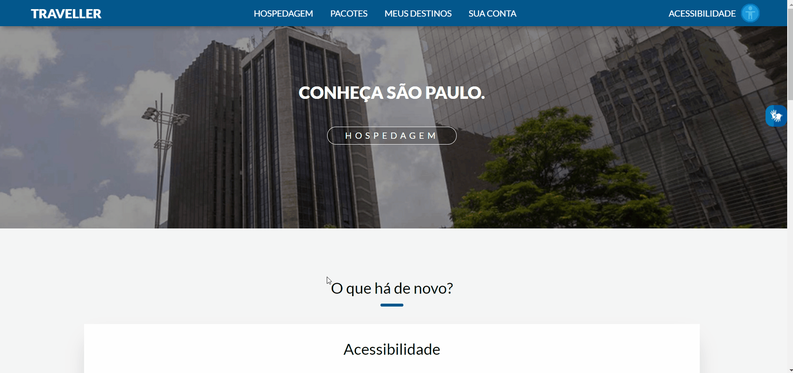
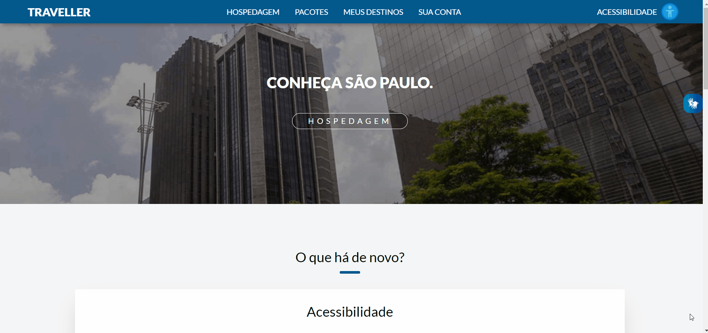

  <h1>Enterprise Connection 2 - acessibilidade</h1>
  
Nesse projeto botamos em pratica nossos conhecimentos sobre acessibilidade, tornando assim, a experiência de alguns grupos de usuarios mais agradavel

  <h2>Tamanho dos textos</h2>
  

  <h2>Alterando fonte para dislexia</h2>
  

  <h2>VLibras para surdos</h2>
  

